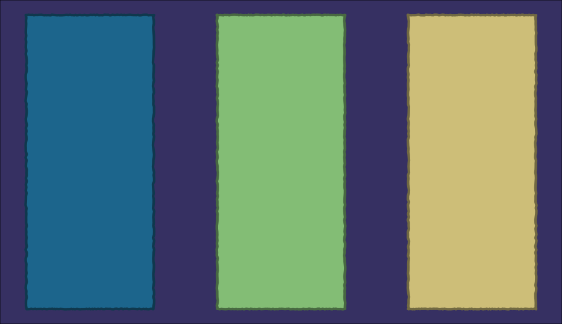

```{r setup, include=FALSE}
options(htmltools.dir.version = FALSE)
```

class: dark, animated, fadeIn


<h1><span>Reach Out</span></h1>

<div class = "contactbox">


<div class = "contact">
<br>
<a href="https://twitter.com/meghansharris">@meghansharris</a>
<br>
<a href="https://thetidytrekker.com">TheTidyTrekker.com</a>
<br>
<a href="https://github.com/Meghansaha">@meghansaha</a>
<br>
<a href="https://www.linkedin.com/in/meghan-harris/">meghan-harris</a>
<br>
<a href="mailto:meghansa@buffalo.edu">meghansa@buffalo.edu</a>

</div>
</div>

---
class: light, animated, fadeIn


<h1><span>What Are We Doing Today?</span></h1>


- What Are Functions in R?


- Why Use Functions in Rtistry?


- Using Base R for Data


- Using Purrr for Data


- Different Types of Functions for Rtistry


- Creating Custom Functions in R


- Live Coding Example


---
class: dark, animated, middle, fadeIn

# <center>What Are Functions in R?</center>

*<center>"Work Smart, Not Hard"</center>*

---
class: light, animated, fadeIn

<h1><span>What Are Functions in R?</span></h1>

Functions are EVERYWHERE in R and you've most likely have used some already even if you haven't made any yourself:
<br>
--

- Functions in R can be considered *objects* that we can use to **do something.**

--

- According to the book [Advanced R](https://adv-r.hadley.nz/functions.html#function-fundamentals) by [Hadley Wickham](https://twitter.com/hadleywickham), Most functions are made up of three parts:
  - `formals()` - arguments that control how the function's called
  - `body()` - the code inside of the function
  - `environment()` - the structure that determines how the function finds the values associated the names in the function

--

- In this presentation, we'll focus mainly on **`formals`** and the **`body`** components of custom functions that can be used in rtistry.

---
class: light, animated, fadeIn

<h1><span>What Are Functions in R?</span></h1>

Let's look at an example of a basic function:

```{r basic_ex, echo=TRUE, eval = TRUE}

# Creating a function named "rtistry_message":
rtistry_message <- function(adjective){
  
  # Setting up our custom message:
  todays_message = paste("Today is a", adjective, "Day for Rtistry!")
  
  # Returning our custom message to the console:
  return(todays_message)
}
```

--
```{r ex_output, echo= TRUE, eval=TRUE}
# Using our function:
rtistry_message("Great")

```

--

The **`adjective`** argument is a `formal()` that will control how the function is called. **Everything** inside of the curly brackets `{ }` is the `body()` of the function. In rtistry, we can create simple or complex functions to assist in the creation of our pieces. 

---

class: dark, animated, middle, fadeIn

# <center>Why Use Functions in Rtistry?</center>

*<center>"No Really. Stop Making Things Hard"</center>*

---
class: light, animated, fadeIn

<h1><span>Why Use Functions in Rtistry?</span></h1>

- Build up a tool box of functionalities, especially for things you'd like to do often.

--
<br><br>
<center></center>

---
class: light, animated, fadeIn

<h1><span>Why Use Functions in Rtistry?</span></h1>

- Streamline code and reduce any manual (copy and paste) work

<br>
--


---
class: light, animated, fadeIn

<h1><span>Why Use Functions in Rtistry?</span></h1>

- Streamline code and reduce any manual (copy and paste) work


---
class: light, animated, fadeIn

<h1><span>Why Use Functions in Rtistry?</span></h1>

- Streamline code and reduce any manual (copy and paste) work

```{r streamline_ex1, echo=TRUE, eval = FALSE}
# Load in your libraries====
library(ggplot2)
library(dplyr)
library(purrr)

#Setting seed for reproducibility====
set.seed(1129)

# Set up some options====
x_transformer <- c(0,15,30)
rectange_groups <- c("right","middle","left")
rectangle_colors <- c("#82954B", "#AC7D88", "#143F6B")
rectangle_borders <- map_chr(rectangle_colors, ~colorRampPalette(c(.x,"#000000"))(10)[5])

# Create a "base" rectangle====
rectangle <- tibble(x = c(seq(0,10, length.out = 100),
                               rep(10,100),
                               seq(10,0, length.out = 100),
                               rep(0,100)),
                         y = c(rep(0,100),
                               seq(0,20, length.out = 100), 
                               rep(20,100),
                               seq(20,0, length.out = 100)))


```

---
class: light, animated, fadeIn

<h1><span>Why Use Functions in Rtistry?</span></h1>

- Streamline code and reduce any manual (copy and paste) work

```{r streamline_ex2, echo=TRUE, eval = FALSE}
# Use Purrr functions to apply options to the base rectangle and create the data needed====
rectangles_df <- pmap_df(list(x_transformer,
                             rectange_groups,
                             rectangle_colors,
                             rectangle_borders), ~rectangle %>%
                                                  mutate(x = x + ..1,
                                                         group = ..2,
                                                         fill = ..3,
                                                         color = ..4))
# Plot the piece====
rectangles_df  %>%
  ggplot(aes(x = x, y = y, group = group)) +
  theme_void()+
  geom_polygon(fill = rectangles_df$fill , 
               color = rectangles_df$color, 
               size = 1.5, 
               position = position_jitter(width = .05, height = .02)) +
  theme(plot.background = element_rect(fill = "#F1DDBF"))
```

---
class: light, animated, fadeIn

<h1><span>Why Use Functions in Rtistry?</span></h1>

- Streamline code and reduce any manual (copy and paste) work


---
class: light, animated, fadeIn

<h1><span>Why Use Functions in Rtistry?</span></h1>

- Make it easier to create variations in your work

```{r variations_ex1, echo=TRUE, eval = FALSE}
# Load in your libraries====
library(ggplot2)
library(dplyr)
library(purrr)

#Setting seed for reproducibility====
set.seed(1129)

# Set up some options====
x_transformer <- c(0,15,30)
rectange_groups <- c("right","middle","left")
rectangle_colors <- c("#1C658C", "#83BD75", "#CDBE78")
back_color <- "#363062"


# Just wrap everything in a custom function for better readability and ease====
rectangle_maker <- function(transformer, groups, colors){...}

# Use the custom function to make the data====
rectangles_df <- rectangle_maker(x_transformer, rectange_groups, rectangle_colors)

```

???
Rectangle colors =  blue, green, yellow
<br>
background color = purple

---
class: light, animated, fadeIn

<h1><span>Why Use Functions in Rtistry?</span></h1>

- Make it easier to create variations in your work

```{r variations_ex2, echo=TRUE, eval = FALSE}
# Plot the piece====
rectangles_df  %>%
  ggplot(aes(x = x, y = y, group = group)) +
  theme_void()+
  geom_polygon(fill = rectangles_df$fill , 
               color = rectangles_df$color, 
               size = 1.5, 
               position = position_jitter(width = .05, height = .02)) +
  theme(plot.background = element_rect(fill = back_color))
```

???
Background color object is put directly into the ggplot's theme function, we could put this in the function if we place the ggplot function in the "rectangle_maker" function as well 

---
class: light, animated, fadeIn

<h1><span>Why Use Functions in Rtistry?</span></h1>

- Make it easier to create variations in your work





---
class: light, animated, fadeIn

<h1><span>Using Base R for Data</span></h1>

We've already seen some examples of how we can create functions in R with the `function()` directive. Just like with many processes in R, you can make functions completely using Base R without any extra packages, if you're an R purist.

--
- There's no limit to what functions you can use in Base R to make your data but here's a few that are in my toolbox:
<br>
<br>

--
    -  <a href="https://www.rdocumentation.org/packages/base/versions/3.6.2/topics/function"> `function()`</a>
--
    -  <a href="https://www.rdocumentation.org/packages/memisc/versions/0.99.30.7/topics/Sapply"> `sapply()` and `lapply()`</a>
--
    -  <a href="https://www.rdocumentation.org/packages/base/versions/3.6.2/topics/sample"> `sample()`</a>
--
    -  <a href="https://www.rdocumentation.org/packages/base/versions/3.6.2/topics/rep"> `rep()`</a>
--
    - <a href="https://www.rdocumentation.org/packages/base/versions/3.6.2/topics/expand.grid"> `expand.grid()`</a>
--
    - <a href="https://www.rdocumentation.org/packages/base/versions/3.6.2/topics/Control">Control Flows</a>
